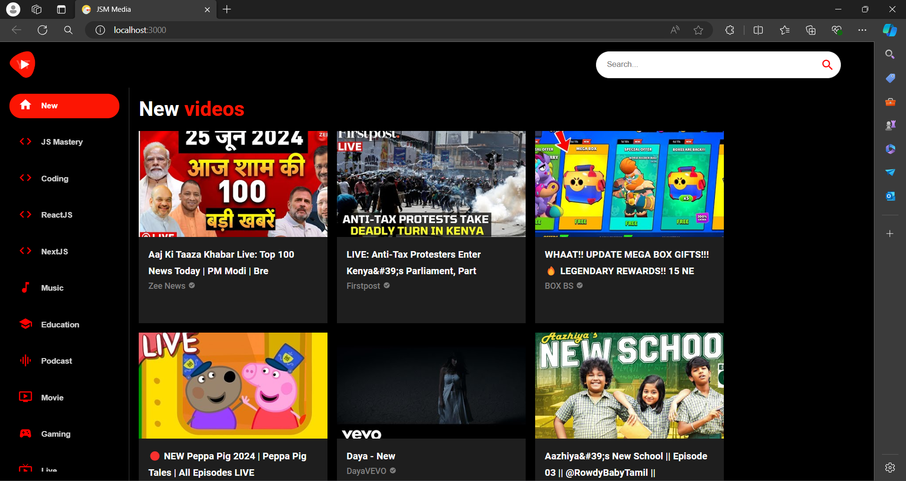

# youtube_clone

Youtube_clone is an engaging web-based game crafted using fundamental web technologies such as HTML, CSS, and JavaScript. The game combines visual appeal with interactive functionality, demonstrating the use of basic web development concepts and JavaScript logic.

## Features

-HTML and CSS Integration: The game leverages HTML for structuring the content and CSS for styling, creating an aesthetically pleasing user interface.

-JavaScript Logic: The core functionality of Youtube_clone is powered by JavaScript. The use of querySelector() is showcased for efficient element selection, emphasizing a key aspect of modern JavaScript development.

-Dynamic Value Manipulation: Explore the implementation of dynamic value manipulation in JavaScript, such as incrementing scores when bubbles are matched with the corresponding numbers.

-Interactive Gameplay: Experience how JavaScript brings interactivity to the game, creating a responsive and engaging user experience.

## Contributing

If you're interested in contributing to Youtube_clone, feel free to fork the repository and submit pull requests. Your contributions are highly welcome!

## License

Youtube_clone is licensed under the MIT License, making it open for collaboration and reuse.

## Acknowledgements

 Special thanks to the web development community for inspiration and support.

Feel free to customize the sections based on your project's specifics, and don't forget to replace the placeholder for the license link with the actual link. This README provides a structured overview of your project, making it more accessible to others who may come across your GitHub repository.

